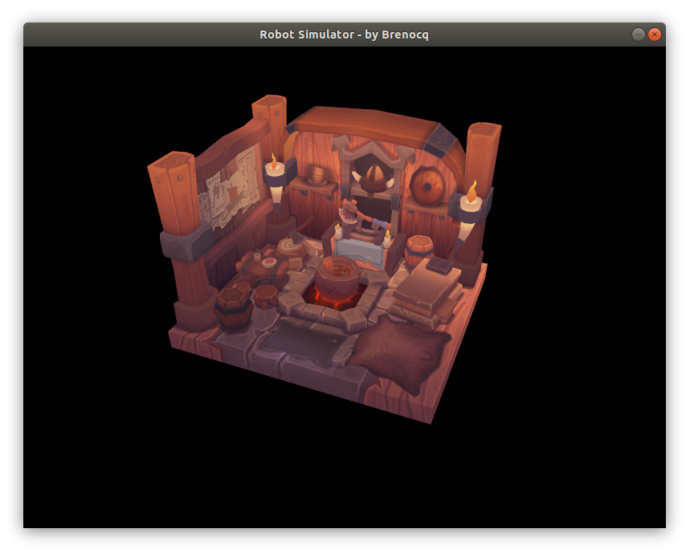

# Robot Simulator
<p align="center">
 
</p>

Robot simulator for 2D and 3D applications made with Vulkan (optional ray tracing for Nvidia GPUs).
So far, we can only simulate a viking room :)

## Running
```shell
git clone https://github.com/Brenocq/RobotSimulator.git
cd RobotSimulator
make clean
# After installation:
make run -j4
```

## Progress
These values are unreliable and come from what I think is going on in the code kk (things could change tomorroy as new ideas emerge).

#### Core
 - GPU Rendering (Vulkan): 90%
 - RayTracing (Nvidia): 80%
 - User interface (Imgui): 5%
 - Physics engine (Bullet): 0%
 - GPU acceleration (Cuda): 0%

## Installation (Linux)
#### Updating g++
This simulator is using some libraries that were experimental in old version of g++. We can or change all #include<xxx> with erros to #include<experimental/xxx>, or update the g++.

Please use g++ v8.2 or later to compile without errors.
``` shell
g++ --version
sudo add-apt-repository ppa:ubuntu-toolchain-r/test
sudo apt-get update
sudo apt-get install gcc-8 g++-8
sudo update-alternatives --install /usr/bin/g++ g++ /usr/bin/g++-8 40
g++ --version
```

#### Download Vulkan SDK
First we need to download the vulkan SDK, I'm using the release 1.2.135.0.
You can download the vulkan SDK [here](https://vulkan.lunarg.com/sdk/home).

Extract the files to some folder.
``` shell
tar -xzf vulkansdk-linux-x86_64-xxx.tar.gz
```

#### Install GLFW
Now we need to install the GLFW to create windows.

``` shell
sudo apt-get install libglfw3-dev
```
If you prefer, you can build manually from the [official website](https://www.glfw.org/).

#### Install GLM
Now we'll have to download the GLM library to perform linear algebra.

``` shell
sudo apt install libglm-dev
```

#### Change Makefile
The last pass is to change the vulkan SDK path in the makefile:

``` Makefile
# Open Makefile
VULKAN_SDK_PATH = <path>/<xxx>/x86_64
```

## References
- [Alexander Overvoorde's Vulkan Tutorial](https://vulkan-tutorial.com/)
- [Vulkan Programming Guide: The Official Guide to Learning Vulkan](http://www.vulkanprogrammingguide.com/)
- [Guthmann's Imgui Tutorial](https://frguthmann.github.io/posts/vulkan_imgui/)

## License
This project is licensed under the MIT License - check [LICENSE](LICENSE) for details.
