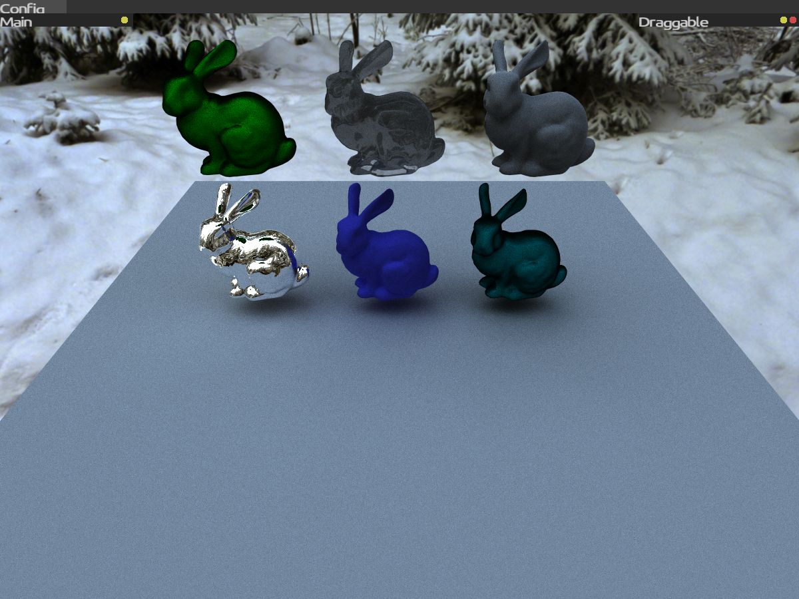
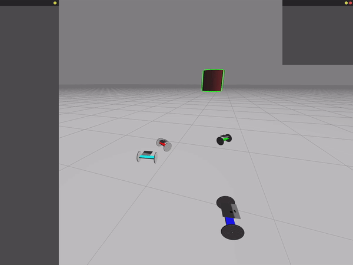

# Atta - Robot Simulator
<p align="center">
 
 
 
</p>

Atta is a robot simulator for 2D and 3D applications. For now, the core is still under development, which includes:
 - **Ray Tracing:** My implementation of a physically based ray tracer based on the pbrt-v3 using the Vulkan khronos ray tracing extension for ray calculations. In the future I will also implement it on CPU.
 - **GUI:** The graphics user interface is being developed using a widget tree model (only basic widgets are finished).
 - **Physics Engine:** It is in its early stages. (I am debbuging it)
 - **Robotics:** After finishing the basics of the three above, I will start to implement the sensors/actuators/common algorithms.
 - **Examples:** There will be an example repository that is still in development.

Today only Linux is supported, but I plan to add support for Windows in the following months.\
This project is not yet well documented, I am creating a website in parallel to document the source code and project examples, but it is not yet available.

## Installation (Linux)
#### Download Vulkan SDK (must)
First we need to download the vulkan SDK, I'm using the release 1.2.162.1.
You can download the Vulkan SDK [here](https://vulkan.lunarg.com/sdk/home).

Extract the files to some folder.
``` bash
tar -xzf vulkansdk-linux-x86_64-xxx.tar.gz
cd xxx
./setup-env.sh
```
Be sure that vulkan environment variables are defined in your system (VULKAN_SDK) when instaling atta and running atta projects

#### Install from AUR package
``` bash
sudo pacman -S atta
```

#### Or install from source
**Install dependencies**\
Ubuntu:
``` bash
sudo apt-get install libglfw3-dev freetype2-demos vulkan-sdk
```

AUR:
``` bash
sudo pacman -S glfw freetype vulkan-headers
```

**Install atta**\
Obs: The -E flag is required to access vulkan environment variables
```bash
git clone https://github.com/Brenocq/Atta.git
cd Atta
sudo -E ./scripts/install.sh
```

## Running
No examples will appear during the atta execution because they are in development. (You will only see a black screen with the GUI)\
(Please make sure you are using g++-10)
(Some errors have been reported when using clang, I will solve them soon)
```bash
atta
```

## Progress
These values are unreliable and come from what I think is going on in the code (things can potentially change as new ideas emerge).

#### Core
 - Vulkan specific: 100%
 - Renderers
	 - RayTracing (GPU/vulkan): 65%
	 - RayTracing (CPU): 5%
	 - Rasterization: 50%
	 - 2D: 65%
 - GUI: 20%
 - Physics engine: 60%
 - Multithreading: 50%

## References
- [(Book) Physically Based Rendering](http://www.pbr-book.org/)
- [(Book) Game Physics Engine Development](https://www.amazon.com/Game-Physics-Engine-Development-Commercial-Grade/dp/0123819768)
- [(Book) Real-Time Collision Detection](https://www.amazon.com/Real-Time-Collision-Detection-Interactive-Technology/dp/1558607323)
- [(Book) Computer Graphics Principles and Practice](http://cgpp.net/about.xml)
- [(Book) Programming Massively Parallel Processors](https://www.amazon.com/Programming-Massively-Parallel-Processors-Hands/dp/0128119861)

## License
This project is licensed under the MIT License - check [LICENSE](LICENSE) for details.
