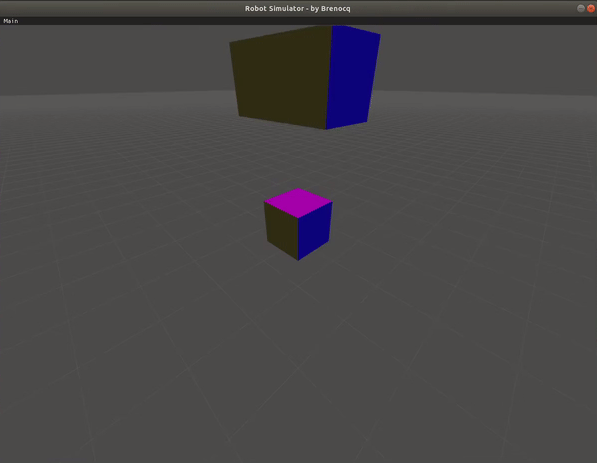
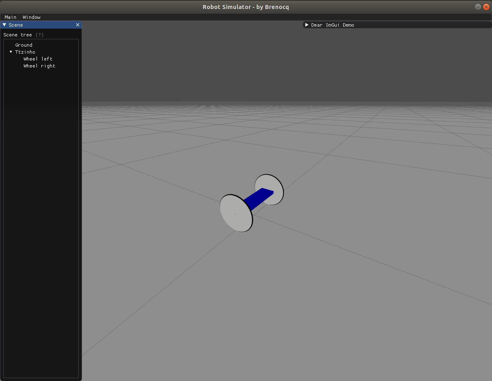
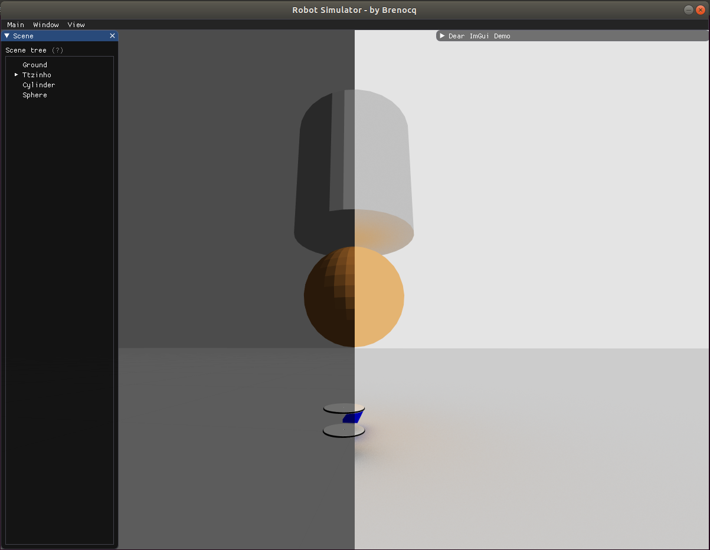

# Robot Simulator
<p align="center">
 
 
 
</p>

Robot simulator for 2D and 3D applications made with Vulkan (optional Ray Tracing for Nvidia GPUs). Now I am developing the camera sensor and the TFT display, after that start I will start with the physiscs engine :)

## Installation (Linux)
#### Download Vulkan SDK
First we need to download the vulkan SDK, I'm using the release 1.2.154.0.
You can download the vulkan SDK [here](https://vulkan.lunarg.com/sdk/home).

Extract the files to some folder.
``` shell
tar -xzf vulkansdk-linux-x86_64-xxx.tar.gz
```

#### Install the RobotSimulator
```shell
git clone https://github.com/Brenocq/RobotSimulator.git
# Change RobotSimulator/run.sh and RobotSimulator/debug.sh vulkan source to your path 
# Change RobotSimulator/CMakeLists.txt vulkan path to your path
./install.sh
```

## Running
```shell
./run.sh # Release
./debug.sh # Debug with gdb
```

## Progress
These values are unreliable and come from what I think is going on in the code haha (things could change tomorrow as new ideas emerge.)

#### Core
 - GPU Rendering (Vulkan): 90%
 - RayTracing (Nvidia): 85%
 - User interface (Imgui): 20%
 - Physics engine: 5%
 - GPU acceleration (Cuda): 0%

## References
- [Alexander Overvoorde's Vulkan Tutorial](https://vulkan-tutorial.com/)
- [Vulkan Programming Guide: The Official Guide to Learning Vulkan](http://www.vulkanprogrammingguide.com/)
- [Guthmann's Imgui Tutorial](https://frguthmann.github.io/posts/vulkan_imgui/)
- [GPSnoopy's Ray Tracing implementation](https://github.com/GPSnoopy/RayTracingInVulkan)
- [Nvidia Vulkan Ray Tracing Tutorial](https://nvpro-samples.github.io/vk_raytracing_tutorial_KHR/)
- [Learning Game Physics with Bullet Physics and OpenGL](https://www.amazon.com.br/Learning-Game-Physics-Bullet-OpenGL/dp/1783281871)
- [Game Physics Engine Development](https://www.amazon.com.br/Game-Physics-Engine-Development-Commercial-Grade/dp/0123819768)

## License
This project is licensed under the MIT License - check [LICENSE](LICENSE) for details.
